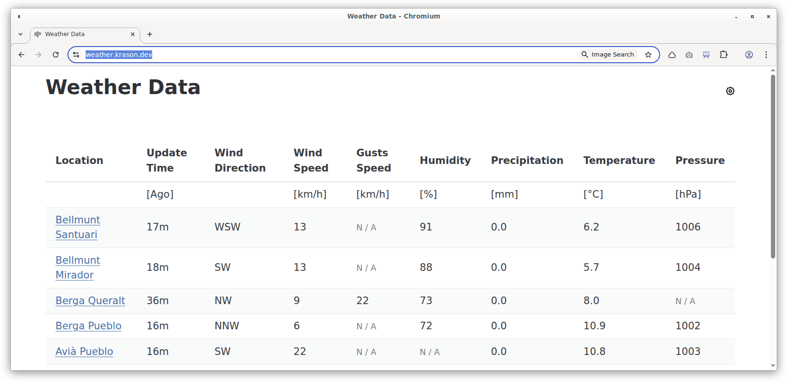

# Weather Data Aggregator

Agregates data from meteo stations. Full stack app. Provides web UI and public API.

API is source of the data for this IoT project: [retro-clock](https://github.com/gergelyk/retro-clock)



Application is available at: https://weather.krason.dev/

**Features:**
- Configuration stored in the cookies.
- Customizable rows and columns.
- Integration with [lesma](https://lesma.eu/), for editing/sharing configuration.

**Supported providers:**
- https://www.aemet.es
- https://www.meteo.cat
- https://www.meteoclimatic.net
- https://www.weatherlink.com
- https://www.openwindmap.org

## Setup

1. Install spin framework as described on the [webpage](https://spinframework.dev/)
2. Make sure that wasm32 targets are added to the toolchain
  ```sh
  cd ui
  rustup show # check which toolchain is active
  # for the active toolchain (1.86.0):
  rustup +1.86.0 target add wasm32-unknown-unknown // used for frontend compilation
  rustup +1.86.0 target add wasm32-wasip1          // used for backend compilation
  ```

## Development

```sh
set-env SPIN_VARIABLE_KV_EXPLORER_USER demo
set-env SPIN_VARIABLE_KV_EXPLORER_PASSWORD demo
set-env SPIN_VARIABLE_API_TOKEN demo
spin up --build --runtime-config-file runtime_config.toml
curl -X POST -d @api/examples/mixed.json 'http://127.0.0.1:3000/api/v1?token=demo'
```

Notes:
- Use `spin watch` to rebuild & run the app on changes.
- Temporarily comment out line with `data-wasm-opt="z"` in `index.html`
  and section [profile.release] in Cargo.toml for faster development cycle.

## Deployment

```sh
set-env SPIN_VARIABLE_API_TOKEN (tr -dc A-Za-z0-9 </dev/urandom | head -c 16)
spin deploy --build ^
--variable api_token=$E:SPIN_VARIABLE_API_TOKEN ^
--variable kv_explorer_user=$E:SPIN_VARIABLE_KV_EXPLORER_USER ^
--variable kv_explorer_password=$E:SPIN_VARIABLE_KV_EXPLORER_PASSWORD
curl -X POST -d @api/examples/mixed.json 'https://weather.fermyon.app/api/v1?token='$E:SPIN_VARIABLE_API_TOKEN
```

Notes:
- Temporarily change name of the application in `spin.toml` if you would like to test before deploying to production.


